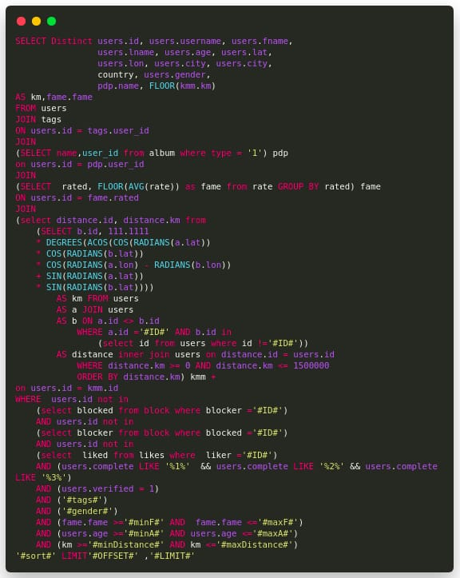

# Matcha
Tinder like web application, where you can Upload && Share up to 5 pictures, you can search your match by [Age, distance, city, country, interests, gender, ...] , also you get notified on new matchs and have a live chat with them, also, if you dont like a match or not what u expect , there is an uption to UnMatch the sh*t out them :) 


### Demo:
[Watch the demo video](./demo.webm)

### Requirements:
- Nodejs v14.21.3
- npmn 6.14.18
- mysql 5.7
- python < 3.10 (bcrypt/mmagic need older python version to rebuild)
    ```
    sudo apt update
    sudo apt install -y python3.10 python3.10-distutils
    npm config set python /usr/bin/python3.10 
    ```
### How to run:
```
docker-compose up
npm run ch3l
```

### Techs used:
- Nodejs
- ExpressJs
- SQL
- JavaScript
- SocketIO
- EJS

### Objectives:
- learned SQL
- learned how to create interactive web apps using JS libraries
- learned how to create real time apps using SocketIO
- learned how to learn.
- lot of fun
- this is the Biggest SQL query i ever wrote in my enitre life hhhhhhhhhhhh :D, i spent lot of time writing that and i enjoyed it to be honest (thats the query responsible of fetching matches based on given filter)

### Realisation Date:
- late 2018, dont have exact time

### NOTE:
- the project used old techs, some of the packages didnt work while i was trying to record a use demo (mapbox, mmagic...), as fixed the map as screenshot for the sake of recording the video.
- i dont plant to refact this project, just for record and portfolio

